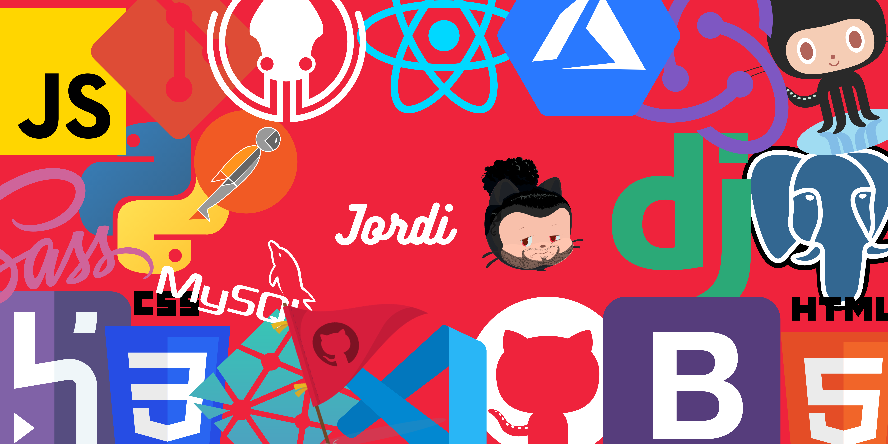

### Hey everyone, I'm Jordi :)

### I'm a Frontend developer

Jordi is a Frontend Developer and a Github Campus Expert. He loves to develop web applications with React and Django and help others to learn new technologies. He is founder of the Tribal Devs community, an organization who wants to help students to develop software with the newest technologies. Currently, Jordi is a freelancer and a Frontend Developer at Hackademy MX.

- :star2: I'm currently working at <a href="https://hackademy.lat/">Hackademy MX</a> as a Frontend Developer.
- 🚩 <a href="https://githubcampus.expert/JordiEspinozaMendoza/">GitHub Campus Expert</a> since 2021
- :star2: I'm Founder of Tribal Devs Community.
- <a href="https://www.itsmejordi.live/#/">Portfolio</a>
- :computer: I like web design and making websites.
- :star2: Former Padawan at <a href="https://hackademy.lat/">Hackademy MX</a>
- <a href="https://www.itsmejordi.live/#/">Here is my portfolio</a>
- :muscle: Fun fact: I'm a wrestling fan

#### I'm currently

- Reading Cracking The Coding Interview
- Being a Mentor at Hackademy MX
- Learning Next.js
- Giving talks at conferences
- Collaborating with UABC
- Working on my own projects

#### Languages and Tools:

<!-- HTML logo -->

<!-- CSS logo -->

<!-- Sass logo -->

<!-- JavaScript logo -->

<!-- React logo -->

<!-- Netlify logo -->

<!-- GitHub logo -->

<!-- Heroku logo -->

<!-- Azure logo -->

<!-- Figma logo -->

#### Let's get in touch

<!-- Linkedln -->

<!-- Email -->

|     Class      | Schedule |
| :------------: | :------: |
|    Admon DB    | L-V 1 pm |
|  Ing software  | L-V 2 pm |
| Lang Automotas | L-J 3 pm |
| Lang Interfaz  | L-J 4 pm |
|   Taller SO    | L-J 4 pm |
|     Redes      | L-V 6 pm |
